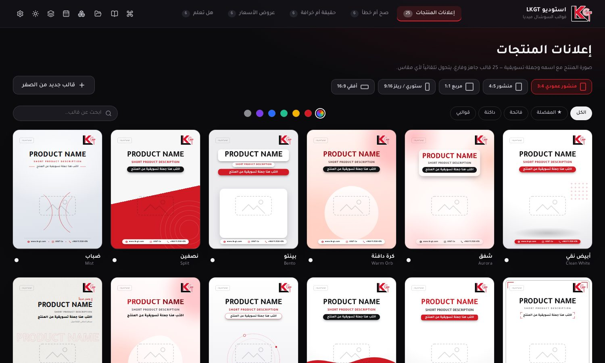
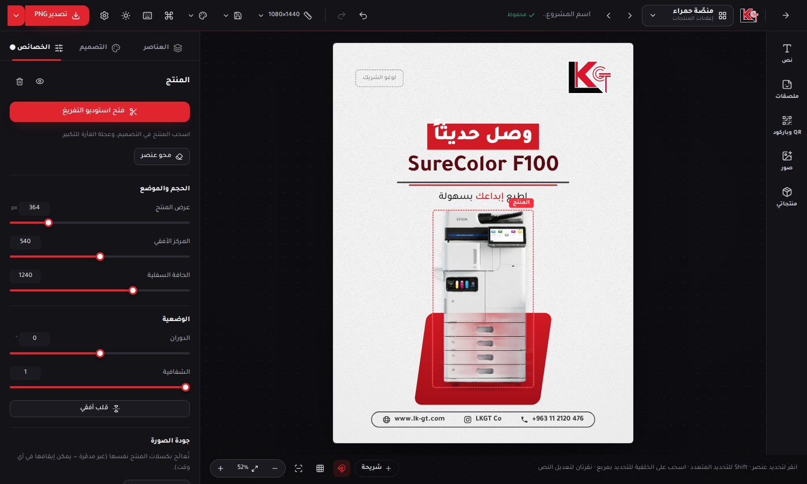

<div dir="rtl">

# LKGT Studio — استوديو قوالب LKGT

محرّر قوالب سوشال ميديا لشركة **LKGT**: إعلانات المنتجات، صح أم خطأ، حقيقة أم خرافة، عروض الأسعار، هل تعلم — بمقاس إنستغرام **1080 × 1440** وأي مقاس آخر (ستوري، مربع، أفقي…) بإعادة ترتيب ذكية تلقائية.




---

## التشغيل

1. ثبّت **Node.js** (نسخة LTS) من <https://nodejs.org> — مرة واحدة فقط.
2. **ويندوز:** انقر مرتين على `start.bat` — **ماك:** `start.command` — أو من الطرفية: `npm install` ثم `npm run dev`.
3. يفتح البرنامج على `http://localhost:5173` — يُفضّل **Chrome أو Edge** (أفضل دعم للتصدير السريع MP4 والخطوط).

للاستخدام اليومي كتطبيق يعمل **بدون إنترنت**: `npm run build && npm run preview` ثم افتح الرابط وثبّته من **الإعدادات ← التطبيق** (أو أيقونة التثبيت في شريط العنوان).

> كل شيء يعمل محلياً على جهازك: الصور والمشاريع تُحفظ داخل المتصفح، ولا يُرفع شيء لأي خادم. الاستثناء الوحيد اختياري: وضع Claude في مساعد الكتابة (يرسل الموضوع والكلمات المفتاحية فقط إلى Anthropic بمفتاحك الخاص).

---

## ابدأ في 5 خطوات

1. **اختر القالب والمقاس** من الصفحة الرئيسية (5 فئات · 49 قالباً فارغاً، فاتحة وداكنة، مع بحث وتصفية بالألوان والمفضلة).
2. **أسقط صورة المنتج:** يُفرَّغ تلقائياً ويُبرَز فوق تدرّج الخلفية. صور PNG الشفافة تُستخدم مباشرة.
3. **اكتب النصوص** (تبويب «العناصر» أو نقر مزدوج على النص). ضع *كلمة* بين نجمتين لتلوينها.
4. **خصّص** من تبويب «التصميم» وشريط الإضافة (نصوص، ملصقات، QR، صور).
5. **راجع وصدّر:** فحص الجودة ثم «تصدير» — أو **التصدير المتقدم** لمقاسات متعددة وPDF وفيديو.

زر **دليل البرنامج** 📖 في الصفحة الرئيسية يشرح كل الأدوات، و**Ctrl+K** يفتح لوحة أوامر تجد فيها أي شيء.

---

## الفئات والقوالب

| الفئة | ما فيها |
|---|---|
| **إعلانات المنتجات** (25) | منتج + اسم + جملة تسويقية + مزايا + سعر — فاتحة وداكنة وأحمر |
| **صح أم خطأ** (6) | عبارة + خياران؛ وضعان: **سؤال** و**كشف الإجابة** مع الشرح والمصدر |
| **حقيقة أم خرافة** (6) | نفس الفكرة بأختام «حقيقة/خرافة» |
| **عروض الأسعار** (6) | سعر جديد وقديم مشطوب + نسبة الخصم + مدة العرض + زر إجراء |
| **هل تعلم** (6) | معلومة مفاجئة + رقم كبير + مصدر |

- كل قالب **فارغ** بنصوص نائبة فقط، ويمكن جعل تعديلاتك **الشكل الافتراضي** للقالب (مع استعادة الأصل) أو **حفظها كقالب جديد**.
- **المقاسات:** منشور 3:4 · 4:5 · مربع · ستوري/ريلز 9:16 (مع مناطق آمنة) · أفقي 16:9 · X · فيسبوك/لينكدإن · مقاس مخصص. التحويل يعيد ترتيب المنتج والنصوص واللوغو والشريط ذكياً.

---

## التحرير

- **تحديد متعدد ومحاذاة:** Shift+نقر أو مربع تحديد، محاذاة وتوزيع، تحريك جماعي.
- **خطوط إرشاد ذكية** تلتصق بالحواف والمراكز وأبعاد العناصر (Alt يعطّلها) + شبكة + مناطق آمنة.
- **لوحة الطبقات:** ترتيب، إظهار/إخفاء، قفل، تسمية، سحب لتغيير الطبقة.
- **النصوص:** ملاءمة تلقائية للعرض، **كشيدة**، توزيع متوازن للأسطر، انحناء على قوس، تعبئة الحروف بصورة، تدرج، حدود، ظل/توهج، بطاقات (زجاجية/ملونة/إطار)، **أنماط جاهزة** ونسخ/لصق التنسيق.
- **العناصر:** أكثر من 160 ملصقاً وشارة وشكلاً وسهماً وأيقونة، **QR وباركود** (رابط، واتساب، هاتف، بريد، نص)، صور إضافية بأقنعة وأطر أجهزة (هاتف، لابتوب، متصفح…)، **منتجات متعددة** بتفريغ لكل منها، وأيقونات التواصل.
- **استوديو التفريغ:** تحديد ذكي بالنقر، عصا سحرية، فرشاة، لاسو، تنقية وتنعيم الحواف وإزالة الهالة.
- **الخطوط:** العربي دائماً **Araboto** والإنكليزي **HP Simplified** (يتبدّل حرفاً بحرف داخل السطر)، والواجهة بخط **Qomra**. تُكتشف تلقائياً من جهازك أو تُستورد من **الإعدادات ← الخطوط**.
- **قواعد ذكية:** «أقصى عدد أسطر» يصغّر الخط تلقائياً عند الطول الزائد، و«يظهر إن كان حقل … معبّأً/فارغاً» (مثلاً: شارة الخصم تختفي إن لم تكتب خصماً).
- **تراجع/إعادة** كامل (Ctrl+Z / Ctrl+Y بأي لغة لوحة مفاتيح).

---

## الأدوات الذكية (قائمة «أدوات» في المحرر)

| الأداة | وظيفتها |
|---|---|
| **مساعد الكتابة** | عناوين وجمل تسويقية وأزرار ومزايا **ونص المنشور والوسوم** حسب الفئة والنبرة (ودّي، رسمي، حماسي، فاخر، عاجل، فضولي). محلي فوري بلا إنترنت، أو **Claude** (اختياري) بمفتاحك من الإعدادات. لا يخترع معلومات عن منتجك. |
| **فحص الجودة** | نصوص نائبة، خطوط صغيرة، **تباين** ضعيف، هوامش، تداخل مع اللوغو، دقة الصور، **إملاء عربي**، مع إصلاح تلقائي. يعمل أيضاً كبوابة قبل التصدير. |
| **اقتراحات ذكية** | بدائل لتصميمك بقوالب وألوان مستخرجة من صورة منتجك. |
| **ألوان من المنتج** | استخراج الألوان الغالبة وتدرجات متناسقة وصبغ التصميم بها (وتنبيه إن كان المنتج محايد اللون). |
| **تصميم من صورة مرجعية** | ارفع تصميماً أعجبك فيُقترح أقرب قالب وألوانه. |
| **محو عنصر من الصورة** | لوّن فوق شعار/غبار/شيء غير مرغوب فيُملأ من المحيط (Inpainting بالرقع). |
| **جودة الصورة** | تحسين تلقائي (مستويات وتشبع وحرارة) وحدّة وإزالة ضجيج وتكبير ×2 للمنتج ولصورة الخلفية. |
| **خامات ومشاهد عرض** | رخام، خشب، خرسانة، تيرازو، بوكيه، غرفة، حرير، أشعة — مولّدة برمجياً وتتلوّن بلونيك. |
| **ظل واقعي** | ظل ملامسة + ظل ممتد بحسب شكل المنتج مع اتجاه ضوء قابل للضبط، وانعكاس. |
| **كاروسيل من نص** | ألصق نصاً فتُولَّد شريحة لكل فقرة. |

---

## الهوية والمشاريع والفريق

- **مجموعات الهوية:** أكثر من علامة/فرع (ألوان، شعار، معلومات تواصل)، مع **إعادة تلوين القوالب الحمراء تلقائياً** بلون المجموعة، و**قفل عناصر الهوية** برمز اختياري.
- **مشاريع:** حفظ تلقائي دائم، عدة شرائح (كاروسيل) بشريط شرائح سفلي، **سجل نسخ** تلقائي ويدوي مع **مقارنة قبل/بعد** واستعادة، وملفات **`.lkgt`** للنسخ الاحتياطي والنقل.
- **حزم الفريق `.lkpack`:** تصدير/استيراد قوالبك وهويتك وأنماطك ومكتبة منتجاتك.
- **مكتبة المنتجات:** احفظ منتجاً مفرّغاً مرة واحدة وأعد استخدامه في أي تصميم.

---

## التصدير

- **سريع:** زر «تصدير» (PNG/JPG × دقة 1 أو 2) — يسبقه فحص جودة تلقائي يمكن إيقافه من **الإعدادات ← التطبيق**.
- **متقدم** (`Ctrl+Shift+E` أو من سهم الزر):
  - **صور:** عدة مقاسات دفعة واحدة في **ZIP**، مع **قالب تسمية** قابل للتخصيص (`{title} {template} {size} {n} {date}`…).
  - **PDF للطباعة:** A3/A4/A5/A6/10×15/13×18 بدقة 150 أو 300 dpi، هوامش، كل شريحة صفحة.
  - **PSD بطبقات** (خلفية، صورة، زخارف، شكل، منتج، نصوص، لوغو وتواصل) للتعديل في فوتوشوب.
  - **فيديو MP4 (H.264)** و**GIF** متحركان بستة أساليب حركة مع معاينة حية، ودعم الكاروسيل (شريحة بعد شريحة)، والإطار الأول = التصميم كاملاً ليصلح غلافاً.
- **توليد جماعي:** جدول Excel/CSV + صور منتجات ← عشرات التصاميم (تفريغ تلقائي)، تُصدَّر ZIP و/أو تُحفظ كمشاريع.

---

## سير العمل والتعاون

- **تقويم المحتوى:** خطّط منشوراتك (فكرة ← تصميم ← جاهز ← منشور)، اربط كل منشور بمشروع، جهّز الصور والنص للنشر بضغطة (مشاركة الجهاز أو تنزيل + نسخ)، وصدّر التقويم `.ics` إلى هاتفك/Google.
- **المراجعة والاعتماد:** يُنشئ ملف **HTML واحداً** يرسله لأي مراجع (واتساب/بريد) فيعلّق على كل شريحة ويعتمد أو يطلب تعديلات بلا حساب أو إنترنت، ثم يعيد الرد (ملف أو رمز) فتستورده هنا.
- **لوحة الأوامر `Ctrl+K`** واختصارات **قابلة للتخصيص** (الاختصارات ← تغيير).

---

## واجهة برمجية للأتمتة

في كونسول المتصفح أو أي سكربت:

```js
lkgt.templates()                              // قائمة القوالب
lkgt.open('clean-white', 'story')             // فتح قالب بمقاس
lkgt.fill({ title: 'EB-L200F', tagline: 'صورة *أوضح*' })
await lkgt.image('https://…/product.png', 'product')
await lkgt.download({ scale: 2, format: 'png' })
const blob = await lkgt.render()              // Blob بدل التنزيل
```

---

## الاختصارات الأساسية

| المفتاح | الوظيفة |
|---|---|
| Ctrl+K | لوحة الأوامر |
| نقر مزدوج | تعديل النص مباشرة (Ctrl+Enter أو Esc للإنهاء) |
| Shift+نقر / مربع تحديد | تحديد متعدد |
| Alt+سحب | تعطيل الالتصاق بالخطوط الإرشادية |
| الأسهم | تحريك دقيق (Shift = 10px) — بدون تحديد: القالب التالي/السابق |
| Ctrl+Z / Ctrl+Y | تراجع / إعادة |
| Ctrl+S | حفظ نسخة مسماة |
| Ctrl+E / Ctrl+Shift+E | تصدير / تصدير متقدم |
| Ctrl+D / Ctrl+C / Ctrl+V | تكرار / نسخ / لصق العنصر (ولصق الصور) |
| Ctrl+L | قفل/فتح العنصر |
| [ و ] | خطوة للخلف/الأمام (طبقة) |

---

## ما لم يُضَف عمداً (بصدق)

- **نشر مباشر على إنستغرام:** يتطلب حساباً تجارياً وخادماً رسمياً من Meta ولا يمكن من متصفح مستقل. البديل المدمج: تجهيز الصور والنص بضغطة، أو الجدولة عبر Meta Business Suite (رابط داخل التقويم).
- **توليد صور بالذكاء الاصطناعي / خلفيات توليدية حقيقية:** يحتاج خدمة خارجية. البديل: خامات ومشاهد مولّدة برمجياً + محو العناصر بالرقع (يناسب الغبار والشعارات والخلفيات المتجانسة؛ الأجسام الكبيرة المعقدة قد تحتاج عدة محاولات).
- **تكبير الدقة ×2** تنعيم وشحذ عالي الجودة وليس «استعادة تفاصيل» بالذكاء الاصطناعي.
- **خطوط عرض إضافية:** الهوية تقتصر على Araboto وHP Simplified (Qomra للواجهة) بحسب قاعدة العلامة.
- **التشكيل التلقائي للنص العربي** يحتاج نموذجاً لغوياً؛ ويمكن لمساعد Claude الاستعانة به يدوياً.
- **تحليلات الأداء واختبار A/B** وصلاحيات الفريق على خادم: خارج نطاق برنامج محلي بلا خادم.
- **PSD:** النصوص تُصدَّر كطبقة صورة عالية الجودة (لا نصاً قابلاً للتحرير) بسبب الخطوط المخصصة. **SVG متجه** غير متاح لأن التصميم مبني بـ HTML/CSS.
- **فيديو H.264:** يتطلب متصفحاً يدعم WebCodecs (Chrome/Edge). في غيرهما يُسجَّل بالزمن الحقيقي (قد يكون VP9/WebM).

---

## للمطوّرين

- **React 19 + TypeScript + Vite** — البوستر DOM/CSS حقيقي (دعم مثالي للعربية والكشيدة وتبديل الخطوط) ويُصدَّر بـ `html-to-image`.
- **Zustand** للحالة + سجل تراجع + حفظ تلقائي (localStorage + IndexedDB للمشاريع والصور).
- **@imgly/background-removal** للتفريغ (onnxruntime-web) — مع Workers لمعالجة القناع وتحسين الصور والمحو.
- **fflate** (ZIP) · **ag-psd** (PSD) · **gifenc** (GIF) · **mp4-muxer + WebCodecs** (MP4) · **qrcode-generator** · **@anthropic-ai/sdk** (اختياري، يُحمَّل عند الحاجة فقط).

```
src/
  model/        ← الأنواع، القوالب (templates.ts / templates2.ts)، الفئات، المقاسات، الألوان
  store/        ← الحالة (editor.ts)، المشاريع، الكائنات، المكتبة، التقويم، القفل
  poster/       ← طبقات البوستر: خلفية، مشهد، شكل، منتج، زخارف/ملصقات/QR/صور، نصوص، لوغوهات، شريط التواصل
  editor/       ← الشريط العلوي، الستيج، اللوحات (عناصر/تصميم/خصائص)، الطبقات، شريط الشرائح
  home/         ← الصفحة الرئيسية وشبكة القوالب
  panels/       ← نوافذ: تصدير، توليد جماعي، تقويم، مراجعة، مساعد الكتابة، فحص، هوية، نسخ، محو…
  lib/          ← exporter · exportJobs · motion · batch · pdf · review · copywriter · claude · check · palette · resize …
  workers/      ← cutout.worker (تفريغ + تحسين الصور) · inpaint.worker (محو العناصر)
  cutout/       ← استوديو التفريغ
public/         ← manifest.webmanifest · sw.js · icons/ (PWA)
```

أوامر: `npm run dev` · `npm run build` · `npm run preview` · `npm run typecheck` · `npm run model:offline` (نموذج التفريغ محلياً للعمل بلا إنترنت نهائياً)

> **ملاحظات:**
> - استُخرجت الهوية (الأحمر `#D11A24`/`#DC142E`، الأسود، الأبيض، حلقات الـG) من شعار الشركة وإعلاناتها؛ عدّل المتغيرات في أول `src/styles/app.css` لمطابقتها تماماً.
> - مكتبة التفريغ `@imgly/background-removal` مرخّصة بـ AGPL-3.0 — مناسبة للاستخدام الداخلي للشركة.
> - لوغوهات Epson وEntrust مستخرجة من الإعلانات السابقة كنسخ مؤقتة — ارفع النسخ الرسمية للحصول على أعلى دقة.

</div>
