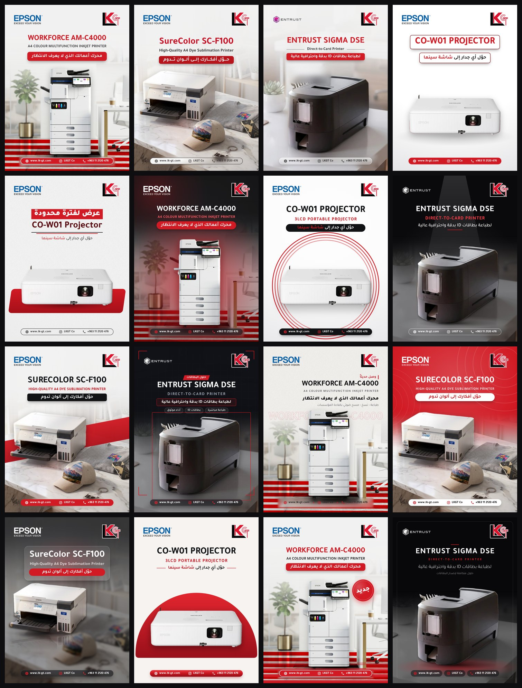

<div dir="rtl">

# LKGT Studio — استوديو قوالب LKGT

محرّر قوالب سوشال ميديا لشركة **LKGT** بمقاس إنستغرام **1080 × 1440**.
المرحلة الحالية: **تصاميم إعلانات المنتجات** (طابعات، سكانرات، بروجكترات، طابعات بطاقات…).
الفئات القادمة (صح أم خطأ، حقيقة أم خرافة، عروض الأسعار، هل تعلم) ظاهرة في الشريط العلوي بانتظار تفعيلها.



---

## التشغيل

1. ثبّت **Node.js** (نسخة LTS) من <https://nodejs.org> — مرة واحدة فقط.
2. **ويندوز:** انقر مرتين على `start.bat`
   **ماك:** انقر مرتين على `start.command`
   (أو من الطرفية: `npm install` ثم `npm run dev`)
3. يفتح البرنامج في المتصفح على `http://localhost:5173` — يُفضّل **Chrome أو Edge**.

> كل شيء يعمل محلياً على جهازك: الصور والتصاميم تُحفظ داخل المتصفح تلقائياً، ولا يُرفع أي شيء لأي خادم.

---

## طريقة العمل

1. **الصفحة الرئيسية:** كل القوالب (25) فارغة بلا صور — قلّب بينها، فلتر (فاتحة/داكنة/قوالبي) أو ابحث، ثم انقر **«استخدام القالب»** لتدخل صفحة التعديل. من قائمة ⋯ على كل قالب: نسخ كقالب جديد / إعادة تسمية / استعادة التصميم الأصلي.
2. **صفحة التعديل** — القائمة الجانبية ثلاثة تبويبات فقط:
   - **العناصر:** رفع الصورة، النصوص (اكتب مباشرة في الحقول)، **+ نص جديد**، لوغو الشريك، الطبقات (إظهار/إخفاء/حذف).
   - **التصميم:** الخلفية والثيم، المنتج والظل والشكل تحته، شريط التواصل واللوغوهات، الزخارف.
   - **الخصائص:** تظهر تلقائياً عند النقر على أي عنصر في التصميم — للنص: النص · اللون والتأثير · البطاقة · الموضع.
3. **تغيير القالب أثناء العمل:** زر اسم القالب أعلى الصفحة يفتح درج القوالب (يبقى محتواك) أو الأسهم.
4. **الحفظ:** «حفظ ← جعله الشكل الافتراضي لهذا القالب» يعدّل القالب نفسه (ويمكن استعادة الأصلي)، أو «حفظ كقالب جديد».

### الجديد في هذا الإصدار
- **كسر البطاقات:** في تبويب «الموضع» لأي نص، أو للكل من «كتلة النصوص» — كل بطاقة تنفصل وتتحرك وتتحجم وتدور بحرية (وتبقى بمكانها بلا قفزة).
- **نصوص جديدة** حرة بكل خيارات النص والبطاقة.
- **خيارات أكبر للنص:** تدرج لوني، حدود الحروف، ظل/توهج، بطاقات بتدرج وظل مخصص وتمويه زجاجي، محاذاة، دوران.
- **أشكال وزخارف وخلفيات جديدة:** بطاقة، موجة، أقواس، مدار — بقع ألوان، موجة، علامات +، شريط نصي — شفق، تدرج، ضباب، شبكة، نقاط.
- **استوديو التفريغ** (زر «استوديو التفريغ» على أي منتج): تحديد ذكي بالنقر يفصل الأجسام بحدودها، عصا سحرية، فرشاة، لاسو، مستطيل، عكس التحديد، إضافة/طرح، تراجع متعدد، تنقية وتنعيم وإزالة هالة الحواف، معاينة على خلفيات مختلفة، وإعادة التفريغ الذكي دون خسارة تعديلاتك.
- **Ctrl+Z** يعمل في كل الأماكن وبأي لغة لوحة مفاتيح (عربي/إنكليزي).
- **خط الواجهة Qomra** بأوزانه (يُكتشف من جهازك، أو من الإعدادات ← الخطوط).

### الثوابت في كل القوالب
- **لوغو LKGT** بحجم ومكان موحّد، و**لوغو الشركة الشريكة** (Epson / Entrust / أي لوغو ترفعه) في الزاوية المقابلة.
  > كتبتَ أن لوغو LKGT في الزاوية **اليمنى**، بينما العينات تضعه يساراً — اعتمدتُ كلامك، وزر «تبديل جهة اللوغوهات» يقلبها بكبسة.
- **شريط التواصل** (الموقع، إنستغرام، الهاتف) مكانه ثابت، وله **14 ثيماً**: أحمر، أحمر بإطار أبيض، أحمر لامع، أبيض، بلّوري، مفرّغ، نصف متدرّج، أيقونات دائرية، أسود، زجاج داكن، مفرّغ فاتح، كبسولات، خط بسيط، شريط عريض.
- المواضع الثابتة قابلة للضبط مرة واحدة من **الإعدادات ← الهوية الثابتة**.

### الخطوط
- العربي دائماً **Araboto**، والإنكليزي دائماً **HP Simplified** — يتبدّل الخط **حرفاً بحرف** حتى داخل نفس السطر (مثال: «طابعة **A4** ملونة **Epson**»).
- لكل نص **وزن عربي** (Thin → Black) و**وزن إنكليزي** (Light / Regular / Bold) مستقلان.
- يكتشف البرنامج الخطوط المثبتة على جهازك تلقائياً (المؤشر أعلى الشاشة يوضح الحالة). إذا لم يجدها:
  **الإعدادات ← الخطوط ← «استيراد من خطوط الجهاز»** (Chrome/Edge) أو «رفع ملفات الخطوط»، أو ضع الملفات في `src/fonts`.
- ميزة **الكشيدة**: تمدّ الجملة العربية لتملأ العرض كما في «حــوّل أفكــارك إلــى ألــوان تــدوم».
- ضع *كلمة* بين نجمتين لتلوينها باللون المميز.

### التفريغ الذكي
- يعمل داخل المتصفح بنموذج ISNet. أول استخدام يُنزّل النموذج (~40–80MB) ثم يُحفظ.
- للعمل **بدون إنترنت نهائياً**: `npm run model:offline` (مرة واحدة).
- لضبط النتيجة: **دقة التفريغ** (عتبات، حذف الشوائب، ملء الفراغات للطابعات البيضاء، تنعيم الحواف) و**تحسين التفريغ بالفرشاة** (مسح/استعادة).
- يمكن أيضاً رفع **PNG مفرّغ جاهز** فيوضع كمنتج مستقل فوق خلفية القالب.

### إنشاء قالب جديد
- عدّل أي تصميم (ألوان، شكل تحت المنتج، زخارف، مواضع النصوص، ثيم الشريط…) ثم **«حفظ كقالب جديد»** — يظهر في «قوالبي».
- أو ابدأ من **«قالب فارغ»**.
- تصدير/استيراد قوالبك كملف واحد (مع صورها) للنسخ الاحتياطي أو لجهاز آخر.

---

## القوالب المدمجة (25)

**فاتحة:** كلاسيك أحمر · استوديو ناعم (كشيدة) · بلّوري · إطار العنوان · منصّة حمراء · حلقات العلامة · شريط مائل · تحريري · قوس · وصل حديثاً
**داكنة:** ليل قرمزي · بقعة ضوء · تقني · بطاقة زجاجية · فخامة
**حمراء:** كتلة حمراء

الحلقات الدائرية في بعض القوالب مستوحاة من حرف **G** في شعار LKGT.

---

## اختصارات

| المفتاح | الوظيفة |
|---|---|
| ← / → | القالب التالي / السابق |
| نقر مزدوج | تعديل النص مباشرة (Ctrl+Enter أو Esc للإنهاء) |
| عجلة الفأرة | تكبير الخلفية أو المنتج المحدد |
| الأسهم مع تحديد | تحريك دقيق (Shift = 10px) |
| Delete | إخفاء القسم المحدد |
| Ctrl+Z / Ctrl+Y | تراجع / إعادة |
| Ctrl+E | تصدير |
| Ctrl+V | لصق صورة |

---

## للمطوّرين

- **React 19 + TypeScript + Vite** — البوستر مبني بـ DOM/CSS حقيقي (دعم مثالي للعربية والكشيدة وتبديل الخطوط)، ويُصدَّر بـ `html-to-image` بدقة البكسل.
- **Zustand** للحالة + سجل تراجع مدمج + حفظ تلقائي (localStorage + IndexedDB للصور).
- **@imgly/background-removal** للتفريغ (onnxruntime-web)، ومعالجة القناع في Web Worker.

```
src/
  model/templates.ts     ← تعريف القوالب (أضف قالباً جديداً هنا بالكود)
  model/brand.ts         ← ألوان الهوية والمواضع الثابتة
  model/demo.ts          ← المحتوى التجريبي
  poster/                ← طبقات البوستر (خلفية، مشهد متدرج، شكل، منتج، زخارف، نصوص، لوغوهات، شريط التواصل)
  brand/LkgtLogo.tsx     ← شعار LKGT متجهي (مُعاد بناؤه من الشعار الأصلي)
  lib/fonts.ts           ← نظام الخطوط المركّبة Araboto + HP Simplified
  lib/textFit.ts         ← ملاءمة العرض + الكشيدة
  workers/cutout.worker.ts ← معالجة قناع التفريغ
  styles/app.css         ← ألوان واجهة البرنامج (متغيرات :root — الداكن افتراضي)
```

أوامر: `npm run dev` · `npm run build` · `npm run typecheck` · `npm run model:offline`

> **ملاحظات:**
> - لم أتمكن من الوصول لصفحة **LKGT Home-3** ولا موقع lk-gt.com من بيئة العمل، فاستخرجتُ الهوية (الأحمر `#D11A24`/`#DC142E`، الأسود، الأبيض، حلقات الـG) من شعار الشركة وإعلاناتها. لمطابقتها تماماً عدّل المتغيرات في أول `src/styles/app.css`.
> - مكتبة التفريغ `@imgly/background-removal` مرخّصة بـ AGPL-3.0 — مناسبة للاستخدام الداخلي للشركة.
> - لوغوهات Epson وEntrust مستخرجة من الإعلانات السابقة كنسخ مؤقتة — ارفع النسخ الرسمية من لوحة «اللوغوهات» للحصول على أعلى دقة.

</div>
